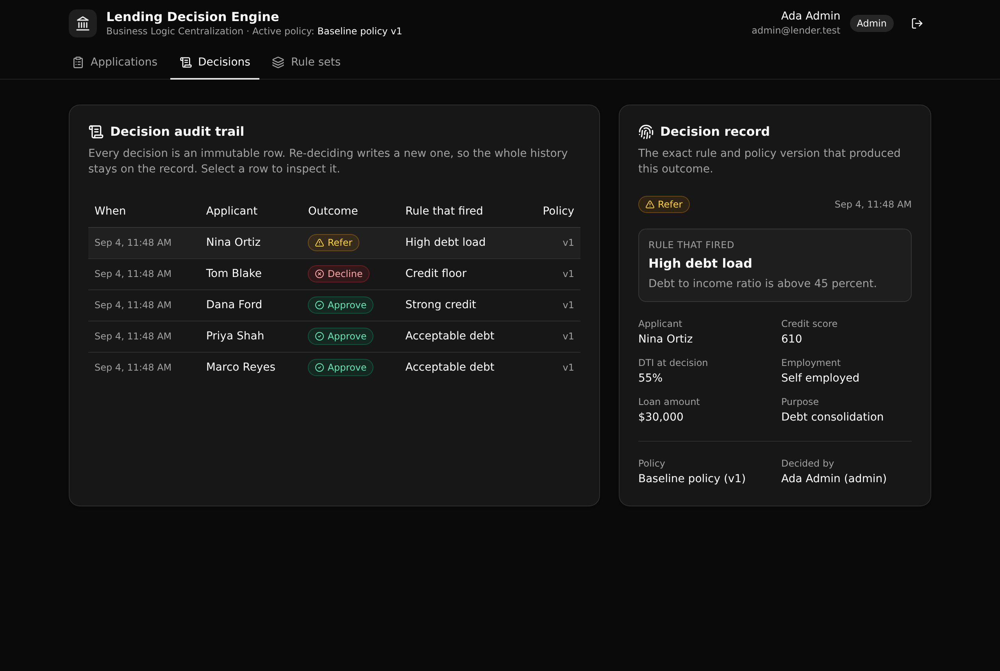

# Lending Decision Engine

A governed loan decisioning API. One versioned policy decides every application, and every
decision returns the exact rule that fired, the policy version that produced it, and a written
audit row.

**Play:** Business Logic Centralization · **Vertical:** Consumer lending · **6 tables · 13 APIs · 1 function**



## What it demonstrates

Underwriting rules (score bands, debt to income cutoffs, policy exclusions) usually end up copied
across an intake app, a partner API, and an internal ops tool. They drift, and no one can say which
version decided a given loan. This backend pulls those rules into one place. Every system calls one
endpoint, gets back approve, refer, or decline, sees the precise rule that fired, and a decision row
is written to the record.

The whole point sits in one function, `decide_application`. Both the API and the seed call it, so
there is one definition of how a loan is decided, not several. Bump the active policy to a new
version and the same application decides differently, on the record. That is the proof an Enterprise
Architect wants: the logic that decides who gets credit lives in one readable, versioned, auditable
layer.

Authentication is API-layer role based access control: an auth table, a token minted with
`s.security.create_auth_token`, and a per endpoint `s.precondition` role guard. A viewer can read.
An underwriter can submit and decide. Only an admin can activate a policy version. There is no
row-level security anywhere; access is decided at the API layer.

## Repo layout

```
xano/
  index.ts                  the workspace: registers every table, endpoint, and the function
  tables/                   users, applicants, applications, rule_sets, decision_rules, decisions
  functions/
    decide-application.ts    the one governed job: the whole waterfall lives here
  api/
    group.ts                 the lending API group (canonical slug pinned so paths stay stable)
    *.ts                     one file per endpoint
  shared/
    enums.ts                 enum value sets shared by columns and inputs
    guards.ts                the requireRole() RBAC helper
frontend/
  src/lib/api.ts            the one contract: paths and types derived from the query defs
  src/views/                Applications, Decisions, Rule sets
  src/App.tsx               the login gate and shell
```

## API surface

All endpoints live under `api:lending`. Roles are enforced by the API, not the UI.

| Method | Path | Role | What it enforces |
| --- | --- | --- | --- |
| POST | `/auth/login` | public | Verifies the password hash, mints an auth token |
| POST | `/seed` | public | Resets and loads the demo data (idempotent) |
| POST | `/applicants` | underwriter, admin | Creates an applicant |
| GET | `/applicants/list` | viewer and up | Lists applicants |
| POST | `/applications` | underwriter, admin | Submits an application, computes the DTI ratio |
| GET | `/applications/list` | viewer and up | Lists applications |
| POST | `/applications/decide` | underwriter, admin | Runs the waterfall, writes an audit row |
| GET | `/decisions/list` | viewer and up | The decision audit trail |
| GET | `/decisions/detail/{decision_id}` | viewer and up | One decision, joined to its rule and applicant |
| GET | `/rule-sets/list` | viewer and up | Lists policy versions |
| GET | `/rules/list` | viewer and up | Lists every rule |
| POST | `/rule-sets/activate` | admin | Activates a version, archives the previous one |
| POST | `/rules/upsert` | underwriter, admin | Adds or edits a rule, only while the version is a draft |

## How a decision is made

`decide_application` loads the one active rule set, walks its rules by priority, and fires the first
whose condition holds. A rule compares one metric (credit score, DTI ratio, loan amount, or
employment) against a threshold with an operator (less than, at most, greater than, at least, or
equals). The first match sets the outcome. If no rule matches, the loan is referred to a person.

The decision writes an immutable row that snapshots the outcome, the firing rule's name and reason,
the policy version, and the DTI at decision time. Re-deciding writes a new row, so the full history
is kept. Nothing overwrites an earlier decision.

## Quick start

```bash
git clone https://github.com/xano-scratch/lending-decision-engine
cd lending-decision-engine
npm install
npx xanots login          # authenticate with Xano (once)
npm run xano:deploy        # deploys the backend and frontend, prints the live URL
```

Then open the printed URL and click "First time? Load the demo data" on the sign-in screen (or send
`POST /api:lending/seed`). Sign in with any demo account below.

| Account | Password | Can |
| --- | --- | --- |
| `admin@lender.test` | `password123` | activate versions, decide, edit rules |
| `underwriter@lender.test` | `password123` | submit, decide, edit rules |
| `viewer@lender.test` | `password123` | read only |

## Try the proof

1. Sign in as admin and open **Decisions**. Every seeded loan was decided under the Baseline policy.
2. Open **Rule sets** and activate the Tightened policy (v2).
3. Open **Applications** and re-decide Marco Reyes and Priya Shah.
4. Back on **Decisions**, Marco moved from approve to refer and Priya from approve to decline. Both
   the old and the new decisions are still on the audit trail, each stamped with its policy version.

## FAQ

**Where do the rules live?** In the `rule_sets` and `decision_rules` tables as data, and the
evaluation in `xano/functions/decide-application.ts`. One function, called by both the API and the
seed.

**How is access controlled?** At the API layer. Each endpoint names the auth table and runs a role
precondition. Permissions are not modeled on the rows.

**Is the deployment permanent?** The links a reviewer is handed point at a short lived ephemeral
environment. The durable artifact is this repo. Clone it and run `npm run xano:deploy` for your own
live copy.

**Can I change the rules?** Yes, on a draft version. Active and archived versions are locked so the
audit trail cannot be rewritten. Create or edit rules through `/rules/upsert`, then activate the
version when it is ready.

## xano.lock

`xano/xano.lock` is committed on purpose. It pins each object's identity and public URL across
renames and environments, so a later deploy stays yours. Every build writes it; do not edit it by
hand.
